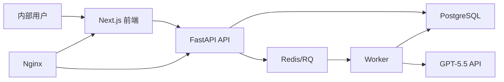

# 专利审查系统技术设计说明

## 背景与目标

本设计以 `docs/PRD.md` v1.0 为产品输入，交付一个可本地 Docker Compose 运行、可部署到阿里云 ECS 的专利文件智能审查 MVP。系统面向实验室内部用户，不开放注册，支持固定账号登录、PDF 上传、文本抽取、异步调用 GPT-5.5 API、Markdown 报告展示、历史任务查询。

当前工作区包含明文密钥文件 `llm_api.md`。该文件不进入 Git 版本库；应用仅从环境变量读取 `GPT_BASE_URL`、`GPT_API_KEY`、`GPT_MODEL`。

## 范围决策

推荐方案：按 PRD 推荐技术栈实现完整本地 MVP。

- 前端使用 Next.js App Router、React、TypeScript、Tailwind CSS。
- 后端使用 FastAPI、SQLAlchemy、Alembic、Pydantic。
- 异步任务使用 Redis + RQ，避免 API 请求等待模型调用。
- 数据库使用 PostgreSQL；测试使用 SQLite 或隔离 PostgreSQL 连接。
- 部署使用 Docker Compose 编排 frontend、backend、worker、postgres、redis、nginx。

备选方案一：先做单体 FastAPI + Jinja 页面。优点是速度快，缺点是偏离 PRD 技术栈，后续迁移成本高。

备选方案二：只做前端原型和接口 Mock。优点是视觉验证快，缺点是无法验证 PDF 抽取、异步任务、模型调用和权限隔离，不满足 MVP 验收。

因此采用推荐方案。阿里云 ECS、域名、HTTPS 证书和 GitHub 推送需要外部凭据；本轮交付部署配置、文档和可执行命令，不把无法验证的远程上线伪装成已完成。

## 系统架构

## 后端设计

后端按业务边界拆分为配置、数据库、认证、PDF 抽取、任务、模型调用和 Worker 模块。

- `backend/app/core/config.py`：读取环境变量，集中定义文件大小、文本长度、模型调用配置。
- `backend/app/core/security.py`：密码哈希、JWT 创建和解析。
- `backend/app/db/`：SQLAlchemy 连接、会话、Base。
- `backend/app/models/`：用户、审查任务、上传文件、模型调用日志。
- `backend/app/schemas/`：API 请求响应模型。
- `backend/app/api/`：认证、审查任务、健康检查接口。
- `backend/app/services/pdf_extractor.py`：仅支持可复制文本型 PDF，扫描件返回用户可读错误。
- `backend/app/services/patent_check_service.py`：创建任务、校验权限、保存元数据、投递 RQ。
- `backend/app/services/model_client.py`：OpenAI 兼容 Chat Completions 调用，带超时、重试、日志。
- `backend/app/worker.py`：执行两阶段审查，保存阶段结果和最终报告，清理原始文件与过程文本。

登录态使用 HttpOnly Cookie 保存 JWT。普通用户只能访问自己的任务；管理员接口第一版不做页面，只提供种子脚本预置 3 个账号。

## 前端设计

前端采用 App Router，业务页面由服务端 Cookie 鉴权保护，浏览器端通过 API 访问后端。

- `/login`：Logo、账号、密码、错误提示。
- `/workspace`：上传表单、技术领域、任务标题、文件限制说明、提交状态。
- `/tasks`：历史列表，支持状态筛选、关键词搜索、分页。
- `/tasks/[id]`：状态轮询、文件元数据、失败原因、Markdown 报告、复制和下载。

设计风格偏内部工具：信息密度适中、状态清晰、少装饰，优先保证重复使用效率。

## 数据与隐私

创建任务时保存上传文件元数据、抽取文本长度和临时文件路径。Worker 完成或失败后清理上传原始文件和过程文本，仅保留状态、错误、阶段结果和最终报告。历史详情不展示完整抽取文本。

## 错误处理

后端将内部异常映射为用户可理解的错误，例如文件格式不支持、文件过大、PDF 无可复制文本、总文本过长、模型超时、模型服务不可用、API key 配置错误。日志保留诊断信息，但不记录完整 API key、完整专利文本或服务器敏感路径。

## 测试策略

- 后端单元测试覆盖配置、密码哈希、PDF 文本抽取、任务权限、文件校验和模型客户端错误映射。
- 后端集成测试覆盖登录、创建任务、查询任务、普通用户越权访问失败。
- 前端至少通过类型检查、Lint 和关键页面渲染检查。
- Docker Compose 验证服务可启动，API 健康检查可访问。

## 部署设计

本地和生产都通过 `.env` 注入配置。生产部署步骤：

1. ECS 安装 Docker 与 Docker Compose。
2. 私有仓库拉取代码。
3. 服务器写入生产 `.env`。
4. `docker compose up -d --build` 启动服务。
5. Nginx 绑定域名并配置 HTTPS。
6. 阿里云 DNS 解析到 ECS 公网 IP。
7. 验证登录、上传、审查、历史记录。

## 自审结论

本设计覆盖 PRD 的 v1.0 MVP；管理员页面、PDF 导出、OCR、SSE、费用统计等仍保持在 v1.1/v1.2。设计没有依赖生产 Codex CLI，不提交密钥，并明确了需要外部凭据的部署动作。
